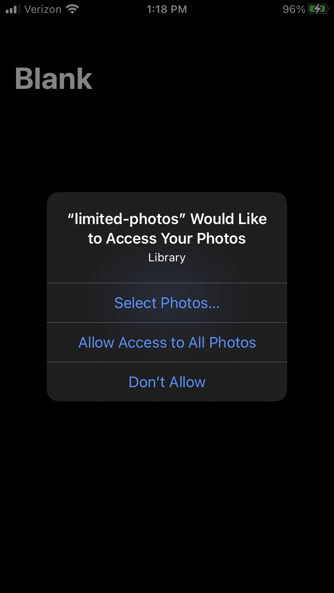
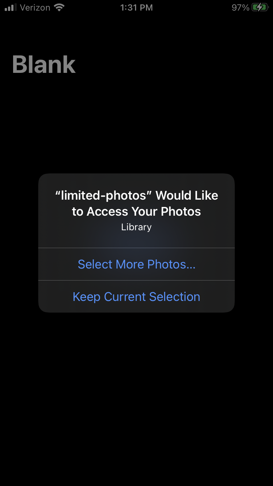

# Capacitor Camera iOS Permissions
This application was created to demonstrate an issue with iOS and photo permissions.
On iOS you can select a subset of images from your photo library that the application will have access to.
The Camera plugin seems to ignore this when presenting the image picker UI.

# Reproduction Steps
Install the packages and add the iOS platform:
```bash
npm install
ionic capacitor add ios
ionic capacitor sync ios
ionic capacitor open ios
```

Add the required `Info.plist` [entries](https://capacitorjs.com/docs/apis/camera#ios).

Run the application on your device, and click the "Get Photo" button.
This should show a permissions prompt like this:
<div>
  
</div>

If you choose "Select Photos...", select a single image from your library to grant access to.
After this, the app should only have permission to access the single photo you just selected, but instead the image picker displays the entire photo library.

I noticed that after the permission prompt and as the picker UI is being displayed, Xcode logged an error (not sure if this is related/helpful):
<div>
  
</div>

Furthermore if I select the image I granted permission for in the last step to select as a result of image picker, I'm presented with a _second_ permission prompt:
<div>
  
</div>

# Expected Behavior
I'm not sure what the exact behavior is supposed to be here, but at the very least I should not be able to view or select images in the picker UI if I did not grant permission for the app to have access.